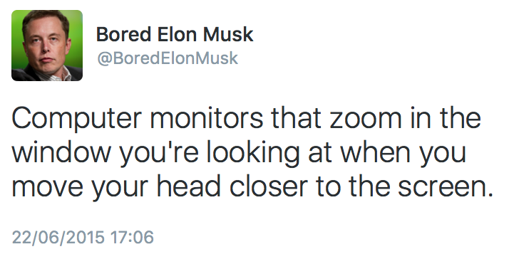

# LeanBack

Simple OS X demo for automatic screen zoom based on distance of your head to the screen, which in turn is determined by measuring the distance between your eyes using CoreImage's face detector.

The idea was based on this tweet:

## Installation

Just fetch the latest ZIP from the [release section](https://github.com/robbertkl/LeanBack/releases) and put the extracted app into your Applications folder.

You might need to disable OS X Gatekeeper to run it: *System Preferences* > *Security & Privacy* > *General* tab > *Allow apps downloaded from: Anywhere*.

## Authors

* Robbert Klarenbeek, <robbertkl@renbeek.nl>

## License

LeanBack is published under the [MIT License](http://www.opensource.org/licenses/mit-license.php).
